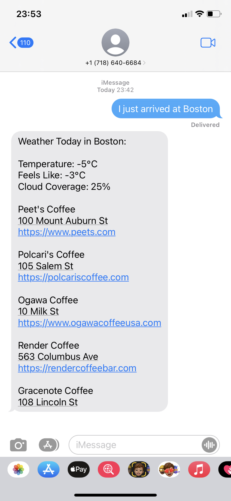

# DALI Lab API developer test

This is a basic chatbot that takes in a message from the user with the city that the user finds him or herself in and looks up relevant information and sends it back to the user. 

Once the user arrives to a new city, the user only has to send a message to the chat bot notifying it of his or her arrival. This message, which presumably contains the city's name, is relayed by a Twilio hook to a server running on heroku. The code in the server takes the name of the city and makes a request for weather information using The Weather API. It then makes a Yelp query with the city's name using the Yelp Fusion API. It aggregates from the results 5 coffee shops and 5 restaurants. All of the data gathered form these APIs is conncatenated to a string which is then sent as a message reply to the user with the Twilio API.

The APIs and/or platforms used for this project were The Twilio API, The Weather API, and Yelp's Fusion API.

The server was developed using nodejs and express. It was run on a Heroku dyno. The library for the RESTful API request used was axios and for the twilio API a wrapper provided as an npm module was used

This is an example of the app running:

 
